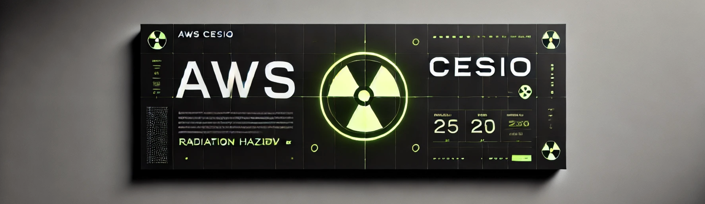

# 🚀 AWS Cesio ☢️ - The Ultimate AWS CLI Toolkit



## **See Through AWS Like X-Rays! 🔬**  
AWS Cesio **☢️** is a **fast, interactive, and beautifully formatted AWS CLI toolkit** that lets you **see through AWS** to retrieve key information effortlessly. No more painful CLI commands—just a sleek, interactive, and powerful experience.  

---

## **🎯 Features**
✅ **Interactive & TUI-Like Menu** – Navigate AWS resources effortlessly  
✅ **Multi-Profile Support** – Easily switch between AWS profiles  
✅ **EC2 & Security Plugins** – Quickly list EC2 instances & AWS Secrets Manager credentials  
✅ **Auto-Detect AWS Config** – Reads AWS profile & region from `~/.aws/config`  
✅ **Funny Loading Messages** – Keep things fun while AWS fetches your data 🛒🐱  
✅ **Sleek Tables & Colors** – Auto-expanding, perfectly aligned tables 📊  
✅ **Quick Exit** – Press **`E`** or **`CTRL+C`** anytime to exit gracefully 🚪  

---

## **📌 Available Commands & Plugins**

### 🎲 **Main Menu Options**
| 🎲 Number | 📌 Description |
|-----------|---------------------------------|
| 1️⃣ | **Compute Plugins** - Manage EC2 instances |
| 2️⃣ | **Security Plugins** - View AWS Secrets & Credentials |
| 🅴 | 🚪 **Exit** the program |

### 🔧 **Compute Plugins (EC2 Instances)**
| 📺 Instance Name | 🔑 ID | 🚦 State | ⚙ Type | 🌍 Public IP | 🏠 Private IP |
|-----------------|------|---------|--------|-------------|--------------|
| cesio-main-node | i-09f8a7b3c2a... | 🟢 Running | t3.medium | 13.248.57.101 | 192.168.1.25 |
| cesio-bastion | i-032a8bf2d4e... | 🔴 Stopped | t2.nano | N/A | 192.168.1.40 |
| worker-node-1 | i-04c1e7d39f2... | 🟢 Running | g4dn.xlarge | 52.14.189.76 | 192.168.1.12 |

### 🔑 **Security Plugins (Secrets & Credentials)**
| 🔐 Secret Name | 📜 ARN | 📅 Created Date | ⏳ Last Accessed |
|---------------|-------|---------------|----------------|
| `/DB/MASTER_PASSWORD` | arn:aws:secretsmanager:us-east-1:1234... | 2025-02-21 | 2025-03-07 |
| `/app/api/credentials` | arn:aws:secretsmanager:us-west-2:1234... | 2025-03-05 | N/A |
| `/internal/dev/auth` | arn:aws:secretsmanager:eu-central-1:1234... | 2025-03-10 | N/A |

---

## **⚡ Installation & Setup**

### **1️⃣ Install Pipenv (Virtual Environment)**
First, install **Pipenv** (if not already installed):
```sh
pip install --user pipenv
```

### **2️⃣ Clone the Repository**
```sh
git clone https://github.com/your-username/aws-cesio.git
cd aws-cesio
```

### **3️⃣ Install Dependencies in a Virtual Environment**
```sh
pipenv install
```

### **4️⃣ Activate the Virtual Environment**
```sh
pipenv shell
```

### **5️⃣ Configure AWS Credentials**
Make sure your AWS CLI is set up with at least one profile:
```sh
aws configure --profile cesio-user
```
You'll be prompted to enter:
- **AWS Access Key ID**
- **AWS Secret Access Key**
- **Default AWS Region** (e.g., `us-east-1`)
- **Output format** (default: `json`)

### **6️⃣ Run AWS Cesio ☢️**
```sh
python main.py
